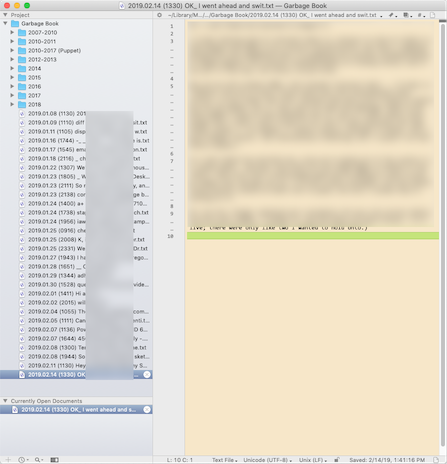

# FMP and Garbage Book are for Taking Notes

Notes. Notes notes notes notes notes. 📝📝📝📝📝📝📝📝📝📝📝📝📝📝📝📝📝

Everyone has their own little system for taking notes, and the only exceptions are the people with ten or twenty little systems for taking notes. Some people use bullet journals, some people use receipts and gum wrappers wadded up at the bottom of their purse, a LOT of people use the built-in Notes app on their telephones, and about thirteen years ago there was even a baffling (yet somehow enticing) vogue for using a stack of index cards with a binder clip. There's only one common thread: no matter who you are or what fucked-up thing you're doing, everyone else's note-taking system sounds impossible to use without going the whole rest of the way around the bend. Why can't they just be sensible and do it your way? I mean _HONESTLY._

And as for me, I use this nonsense. (Plus a completely separate analog system for to-dos and for sketching out stuff where my hands are likely to be dirty the next time I need the info. Plus some weird google calendar habits.)

## What is This?

This README describes a pair of parallel plain-text-based note-taking systems. The rest of the repo has scripts you can bolt together to implement these systems.

- [**FMP**](#fmp) is for remembering stuff. It lets you add a line at a time to any number of named text files.

    I use it for gift ideas, keeping track of the books I read, abnormal shopping lists (like, "wtf was I supposed to look for at Ikea?"), serial numbers, stuff I've loaned out to people, etc.
- [**Garbage Book**](#garbage-book) is for working on stuff. It acts sort of like Apple Notes, except that it uses my favorite text editor(s) instead of a separate app that I don't like as much.

    I use it for drafting blog posts, journaling, and basically anything else where I just need to put some text on a blank page and be able to find it later.

I've been using both of these systems for over ten years, and I think they're convenient and intuitive; they have a quality that I like to call "elegance through stupidity." To you they'll probably sound impossible to use without going the whole rest of the way around the bend, but... on the other hand, maybe not.

## FMP

FMP stands for, uh,

- Fast Memo Pencil
- Fiendish Master Plan
- Free Mashed Potatoes
- Fragmentary Mental Process
- Folder of Messy Piles

Well, tbh there used to be a file on my desktop that I kept all my crap in, and it was called "my fiendish master plan.rtf" because I was 22 and thought that was hilarious, and now I'm kind of stuck with it. 🤷🏽‍♀️ "Folder of Messy Piles" is a better name, imo.

(I actually started doing the ^caret-tag thing in that file long before I had an automated way to extract them, because I just needed to capture the context _somehow_ before I forgot it and I figured those would at least be easy to cmd-F for.)

### What It Is

Here's what you need to build FMP:

- A flat folder of plain text files, synced across all your devices.
- One designated "dump file" in that folder. (I use `fiend.txt`, you could use whatever.)
- A _very fast_ way to append a line to the end of the dump file at any time, regardless of what you're currently doing.
- Something that moves any lines beginning with `^caret-tag` out of the dump file and into `caret-tag.txt`.
    - Caret tags can include letters, numbers, underscores (`_`), and hyphens (`-`). They end at the next space character.
    - `caret-tag.txt` doesn't need to exist yet. It'll get created when it's needed.
    - When moving lines, replace any occurrences of ` // ` (two slashes surrounded by spaces) with a line break. (Technically optional, but trust me, it's nice to have.)
- A _very fast_ way to open any file from the lists folder by name.

### How to Use It

Append a note whenever you need to remember something, using the first `^caret-tag` name that occurs to you. For example, if someone tells me about a book I really need to check out, I'll append something like:

```
^seekbook Ann Leckie - Ancillary Justice
```

Later, when I'm wondering what to read next, I'll open `seekbook.txt` and see what's in there (lots).

The dump file also accumulates a bunch of things without a `^caret-tag`, usually because you didn't immediately have a category for whatever the thing was. That's fine; you can deal with those whenever and add tags if one occurs to you.

As a variant, you could combine your append script and sort script and append directly to the caret-tag files instead of going through the dump file. But I've found that it's sometimes nice to open the dump file and add several unrelated notes in a row, and plus having a separate sort script makes it easy to categorize a bunch of orphaned notes in the dump file after the fact, if you suddenly think of a good place for them.

### Why

In physical space I can't remember where I set things down, and I compensate by predicting the first place I'll try to look for something and just setting it down _there._ This is all the way ass-backwards, but it _does_ at least work (whereas remembering doesn't) and I've gotten quite good at it.

I wasn't thinking about that back when I made FMP, but I think it's that exact same workaround. Just guess which text file you'll open first at the moment when you need this info, and put it in _that_ file. That's also why it's so important to not have any friction when appending to files that don't exist yet; since I'm choosing files from the perspective of my future self, I'm thinking of them as already present, and having to explicitly create the file always felt like someone was trolling me by asking me to repeat myself (when really they heard me just fine the first time).

Having this all in plain text has come in handy — when I got my first iPhone, I could bring it all along with me immediately (in a limited sort of way) without having to wait for someone to build an app that could read its weird tag database or whatever. And it's easy to do other odd stuff with note files whenever I need to. (Pipe them through grep, idk, whatever really.)

### Reference Implementation (Mac and iOS)

#### On Your Mac:

1. Get [FastScripts](https://red-sweater.com/fastscripts/), or some other way to assign global keyboard shortcuts for arbitrary shell scripts and AppleScripts.
1. Get [LaunchBar](https://www.obdev.at/products/launchbar/), or some other tool that, when invoked with a directory of files, lets you incrementally search by typing part of a filename. (I think Alfred is the one that's popular these days, but I haven't tried it. Back when I originally built this, I was still using Quicksilver for everything.)
1. Make a folder in your iCloud Drive called `Lists`, then put a symlink to it in the root of your home folder.
    - iCloud Drive subfolders are in a weird spot on disk! The easiest way to find their real location is to drag the folder from Finder to a terminal window at the moment when you need to type it. Anyway, you'll end up running something like `ln -s "/Users/nick/Library/Mobile Documents/com~apple~CloudDocs/Lists" ~/Lists`.
1. Install the following scripts into `~/Library/Scripts` ([here's how](#installing-scripts-on-mac)):
    - [FMP - Append](./fmp/FMP%20-%20Append.applescript.js)
        - This one uses BBEdit for its optional "Append and open" button; you can edit the script and switch that to your preferred editor if you want.
    - [fmp.rb](./fmp/fmp.rb)
    - [FMP - Open lists folder in LaunchBar](./fmp/FMP%20-%20Open%20lists%20folder%20in%20LaunchBar.applescript.js) (or something equivalent for whatever you're using instead of LaunchBar)
1. Use FastScripts (or whatever) to assign global hotkeys to all three scripts.

That's it! Append a few notes with and without `^caret-tags`, run the refresh script (`fmp.rb`), and check out your notes folder.

#### On Your Telephone or iPad

1. Get Apple's Shortcuts app from the app store.
1. Enable the Shortcuts widget in your "Today" view, if it isn't already on.
    1. Go to your "Today" view (swipe left from the notification center or the home screen).
    1. Scroll to the bottom and tap "edit".
    1. Enable the Shortcuts widget and move it to the top of the list (imo!).
1. Get [iA Writer](https://ia.net/writer).
    - Other text editors would probably work, with a bit of Shortcuts development on your part. You need an editor that can get persistent access to an arbitrary folder from the Files app, and use `x-callback-url` actions to do scripted reading/writing/creation of files in that folder.
1. In iA Writer, add the Lists folder to the Library.
    1. Go to the main "Library" screen.
    1. Tap "Edit" in the upper right.
    1. Tap "Add Location..." at the bottom of the locations list.
    1. Follow the instructions in the pop-up to add your Lists folder. (It's a little goofy, so I'm glad they show that reminder.)
1. In iA Writer, enable URL commands and get your auth token.
    1. Go to the main "Library" screen.
    1. Tap the gear in the upper left.
    1. Tap the "URL Commands" menu.
    1. Flip the enable switch (if it isn't already on) and copy your token. (Well, you'll probably have to come back here to copy it later. But now you know where it is.)
1. Install the following shortcuts into the Shortcuts app ([here's how](#installing-shortcut-files-on-ios); some of them will ask for your auth token during install):
    - [FMP append](./fmp/FMP%20append.shortcut.plist)
    - [FMP Refresh](./fmp/FMP%20Refresh.shortcut.plist)
    - [Open ^file](./fmp/Open%20%5Efile.shortcut.plist)

That's it! Use the shortcuts in the "Today" widget to append some notes and run the refresh, then use the launcher shortcut to open a caret-tag file. I made that one pretty forgiving; you should leave off the `.txt`, but you can include a `^` at the front if you want (I knew I was going to go on autopilot and do that eventually), and it'll automatically trim off any whitespace.

## Garbage Book

This one's real basic — all I wanted was an electronic version of a spiral notebook. Turn to a blank page, do whatever I need to do, turn to a new blank page. If I need a page later, flip backwards until I find it. Tear a page out if I want to move it somewhere else.

The main things here are that:

- The pages should stay in chronological order of when they were created, so that it's easy to "flip back" to find something.
- You should be able to tell at a glance what's in a given page, without having to open the file.
- "Turning to a blank page" should be as close to a single action as possible; you shouldn't have to repeat your intent multiple times by specifying which folder to save it in or choosing a filename.

### What It Is

- A folder of plain text files, synced across all your devices. (You can move older files into subfolders to keep things clean.)
- A scriptable text editor with a really good folder-browsing view.
- A script to save the current text buffer to the Garbage Book folder with an auto-generated filename.
    - Timestamp first (I like `"%Y.%m.%d (%H%M)"`), then the first line of the buffer (truncated if necessary).
- Optionally, a global hotkey to open the Garbage Book folder in your editor's browser view.



### How to Use It

Open a new text editor window and type for a while. When you remember you're in an unsaved buffer, hit the hotkey that saves it in the Garbage Book. Then keep working.

When you need to go back to something you were working on, open the Garbage Book folder in your editor's browser view. Look back to around the time when you were working on Thing, then use the first-line summaries to find the exact page you need.

When you need to do something else with a page (move it into a Git repo, email it to someone, etc.), just drag it to wherever, maybe rename it, your call.

### Why

There were already apps that worked exactly like this in 2007 and earlier! I think Notational Velocity was the first one I used, but the iOS (and, later, Mac) Notes app also fits the bill. But I already had a text editor I really liked ([BBEdit](https://www.barebones.com/products/bbedit/), don't @ me), and the editing interface in those single-purpose notebook apps felt rinky-dink and annoying to me. And they all saved their pages in a database or some weird format instead of just using normal-ass UTF-8 .txt files — what if I need to cat something I'm working on into a shell script, huh??? _What then??????_

Anyway, I barely had to do anything to roll my own replacement. The only hard part was doing text manipulation in AppleScript, which is less of a problem now that you can use JS for OSA scripting instead.

### Reference Implementation (Mac and iOS)

#### On Your Mac:

- Get [BBEdit](https://www.barebones.com/products/bbedit/).
    - Or any other scriptable editor, the whole point here is to use whatever app you're already married to. You'll have to write your own script for it, but that should be easy enough.
- Make a folder in your iCloud Drive called `Garbage Book`; symlink it somewhere if you're feelin' it.
- Install the following scripts into BBEdit's scripts folder ([here's how](#installing-scripts-on-mac); btw, BBEdit's scripts menu has a convenience command to open that folder):
    - [Garbage Book - save page](./garbage_book/Garbage%20Book%20-%20save%20page.applescript.js)
    - [Garbage Book - fix slug](./garbage_book/Garbage%20Book%20-%20fix%20slug.rb)
    - [Garbage Book - tear out page](./garbage_book/Garbage%20Book%20-%20tear%20out%20page.rb)
- In BBEdit's "Menus & Shortcuts" settings, assign a hotkey to at least the save script; the others are optional.
- Optionally, install the following script into `~/Library/Scripts` ([here's how](#installing-scripts-on-mac)) and assign a global hotkey with FastScripts or something:
    - [Garbage Book - Open](./garbage_book/Garbage%20Book%20-%20Open.applescript.js)

That's it! Type some stuff in a new text window, use your hotkey to save it to Garbage Book, and close it. Then, use your "open" hotkey to bring up Garbage Book in a browser window.

The "tear out page" script reverses the timestamp and slug in the filename, which takes a page out of the chronological flow and moves it to the end of the list. Sometimes useful. The "fix slug" script leaves a page in its chronological place, but updates the slug to match the current first line; useful when the current slug doesn't match the content, or if you've been using the iOS shortcut below.

#### On Your Telephone or iPad:

1. Get Apple's Shortcuts app from the app store.
1. Enable the Shortcuts widget in your "Today" view, if it isn't already on.
    1. Go to your "Today" view (swipe left from the notification center or the home screen).
    1. Scroll to the bottom and tap "edit".
    1. Enable the Shortcuts widget and move it to the top of the list (imo!).
1. Get [iA Writer](https://ia.net/writer).
    - Other text editors would probably work, with a bit of Shortcuts development on your part. You need an editor that can get persistent access to an arbitrary folder from the Files app, and has a URL action to create new files in that folder.
1. In iA Writer, add the Garbage Book folder to the Library.
    1. Go to the main "Library" screen.
    1. Tap "Edit" in the upper right.
    1. Tap "Add Location..." at the bottom of the locations list.
    1. Follow the instructions in the pop-up to add your Garbage Book folder.
1. In iA Writer, enable URL commands.
    1. Go to the main "Library" screen.
    1. Tap the gear in the upper left.
    1. Tap the "URL Commands" menu.
    1. Flip the enable switch (if it isn't already on).
1. Install the following shortcuts into the Shortcuts app ([here's how](#installing-shortcut-files-on-ios)):
    - [New Garbage Book Page](./garbage_book/New%20Garbage%20Book%20Page.shortcut.plist)

That's it! Use the shortcut in the "Today" widget to start a new Garbage Book page and type in it for a while.

iA Writer's "Library" view is a fast enough way to browse the folder, so I didn't bother automating that. (Plus you can sort by filename or by recently edited, which is nice on a smaller screen.)

The only bummer is that I couldn't find a way to add the first line of the file to the filename on iOS. You can use the "fix slug" script on your Mac later, or maybe you can think of a good way to automate that on the phone.


------

# Appendix

## Installing Scripts on Mac

Don't save the web pages where you can read the code! Either clone a local copy of the repo, or use the "Clone or Download" button above and choose "Download ZIP".

For apps that support them, Unix-y scripts (`.rb` files and the like) can be dropped into the scripts folder as-is.

But the `.applescript` and `.applescript.js` files in this repo need to be compiled before you can use them:

1. For each file, run `osacompile -o <NAME>.scpt -l JavaScript <NAME>.applescript.js`. (For plain `.applescript` files, omit the `-l JavaScript` option.) For example:

    ```
    osacompile -o "FMP - Append.scpt" -l JavaScript "FMP - Append.applescript.js"
    ```
1. Put the `.scpt` output files in `~/Library/Scripts` (or an app-specific scripts folder).

Alternately, you can use /Applications/Utilities/Script Editor.app to compile scripts, but that can be kind of obnoxious.

What's going on here is that the OS expects these scripts to be saved in a weird binary format that includes both the source code AND some kind of compiled bytecode (or, actually it might be real machine code, now that I'm reading the `osacompile` man page...). I think that used to be necessary to run scripts at a reasonable speed; remember that this stuff dates back to the ancient days of Classic Mac OS, although even today compiling OSA scripts on demand (e.g. by shelling out to `osascript`) is slower than you'd think. The scripts are posted as text here because putting unreadable binary junk into Git is bad form.

## Installing Shortcut Files on iOS

Don't save the web pages where you can read the code! Either clone a local copy of the repo, or use the "Clone or Download" button above and choose "Download ZIP".

After downloading any of the `.shortcut.plist` files in this repo to your Mac, you need to compile them and then get them to your iOS device somehow.

Sharing shortcuts with people seems a bit squirrelly and IDK if anyone has tried to distribute them from GitHub before, so this section is actually speculative and I'm not 100% certain it'll work. But it _should,_ so... try it and lemme know! 😅

1. Run `plutil -convert binary1 <FILES>`, where `<FILES>` is any number of these shortcut files.
    - When you save and export a shortcut, it's saved as a binary plist. I'm distributing them as XML because (sing it with me) putting unreadable binary junk into Git is bad form. Anyway, this changes the XML back into what Shortcuts expects; it SHOULD be cleanly round-trippable, but I guess we'll see.
1. Remove the `.plist` file extensions so they're just `.shortcut`.
1. Send the files to your phone somehow (probably with iCloud Drive or Airdrop) and open them in the Shortcuts app.
1. A couple of them have an "import question" that should trigger when you add them to Shortcuts. Paste your iA Writer URL auth token as the answer.
1. If you're using different filenames or folder paths, edit the shortcuts to match. (I tried to put everything you'd need to change in a variable instead of hardcoding it, hopefully I got everything.)

The shortcuts should already be configured to show up in your "Today" view widget.
