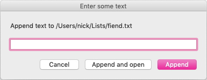

# FMP and Garbage Book are for Taking Notes

This README describes a pair of unpopular plain-text-based note-taking systems, which I've been using continuously for like ten-plus years:

- [**FMP**](#fmp) is for remembering stuff. It lets you add a line at a time to any number of named text files.

    I use it for gift ideas, keeping track of the books I read, abnormal shopping lists (like, "wtf was I supposed to look for at Ikea?"), serial numbers, stuff I've loaned out to people, etc.
- [**Garbage Book**](#garbage-book) is for working on stuff. It acts sort of like Apple Notes, except that it uses my favorite text editor(s) instead of a separate app that I don't like as much.

    I use it for drafting blog posts, journaling, and basically anything else where I just need to put some text on a blank page and be able to find it later.

Both of these systems have a quality that I like to call "elegance through stupidity." You might or might not be looking for that.

## Installation

**You'll want to build your own versions of these anyway!** I assembled FMP and Garbage Book out of apps I was already using and a handful of scripts, and replaced a bunch of parts over the years; really the whole appeal was that I'd keep using what I already liked, and I assume you'll want to do the same.

The scripts in this repo are mostly presented as a source of ideas, a starting point; I don't expect anyone to use my exact setup. _That said,_ here's how to get that exact setup working.

First, check out a local copy of this repo.

### Installing the Mac Stuff

1. Get [FastScripts](https://red-sweater.com/fastscripts/).
1. Get [LaunchBar](https://www.obdev.at/products/launchbar/).
1. Get [BBEdit](https://www.barebones.com/products/bbedit/)
    - (And make sure to launch it at least once before the rest of these steps, just so that the Application Support directory exists.)
1. Make a new folder in iCloud Drive called `Lists`.
1. Make a new folder in iCloud Drive called `Garbage Book`.
1. In your working copy of this repo, run `rake mac` to compile and install all the scripts.
1. In BBEdit's "Menus & Shortcuts" preferences, choose good keyboard shortcuts for the following scripts:
    - [Garbage Book - Save page](./garbage_book/Garbage%20Book%20-%20Save%20page.applescript.js)
    - [Garbage Book - Fix slug](./garbage_book/Garbage%20Book%20-%20Fix%20slug.rb)
    - [Garbage Book - Tear out page](./garbage_book/Garbage%20Book%20-%20Tear%20out%20page.rb)
1. In FastScripts's preferences, choose good **global** keyboard shortcuts for the following scripts:
    - [Garbage Book - Open](./garbage_book/Garbage%20Book%20-%20Open.applescript.js)
    - [FMP - Append](./fmp/FMP%20-%20Append.applescript.js)
    - [FMP - Refresh](./fmp/FMP%20-%20Refresh.rb)
    - [FMP - Open lists folder in LaunchBar](./fmp/FMP%20-%20Open%20lists%20folder%20in%20LaunchBar.applescript.js)

Good to go!

### Installing the iOS Stuff

1. Get [Shortcuts](https://itunes.apple.com/us/app/shortcuts/id915249334).
1. Get [iA Writer](https://itunes.apple.com/us/app/ia-writer/id775737172).
1. Enable the Shortcuts widget in your "Today" view, if it isn't already on.
    - (Swipe left from notifications or the home screen, and tap "Edit" at the bottom.)
1. In iA Writer, add the "Lists" and "Garbage Book" folders to the Library.
    - Go to the main "Library" screen, tap "Edit" in the upper right, tap "Add Location" at the bottom of the "Locations" list, and follow the instructions in the pop-up.
1. In iA Writer, enable URL commands and get your auth token.
    - Go to the main "Library" screen, tap the gear in the upper left, go to "URL Commands", turn the switch on, and copy the token.
1. On your Mac, run `rake ios` in your working copy of this repo.
    - This compiles all the shortcuts and creates an `airdrop` subfolder, which will automatically open in Finder.
1. Open a second Finder window and go to the "AirDrop" thing in the sidebar.
1. Wake up your iOS device.
1. One by one, drag each of the following `.shortcut` files from the first Finder window to your device's AirDrop target. For each shortcut, you'll need to confirm installation; a few of them will also ask you to paste in your iA Writer auth token.
    - [Append to FMP](./fmp/Append%20to%20FMP.shortcut.plist)
    - [FMP Refresh](./fmp/FMP%20Refresh.shortcut.plist)
    - [Open ^file](./fmp/Open%20%5Efile.shortcut.plist)
    - [New Garbage Book page](./garbage_book/New%20Garbage%20Book%20page.shortcut.plist)

Done! You can use these shortcuts from the widget, plus you can use the system share menu for the ones that append to text files.

### Not Installing Anything

1. Just mess around with whatever you want from this repo and make some better scripts and shortcuts of your own!
1. Before that, though, maybe run `rake compile` to convert the shortcuts and the "Javascript For Automation" scripts into formats that Shortcuts and Script Editor.app can handle.
1. AirDrop is probably the best way to get shortcuts back into iOS so you can check them out in the normal Shortcuts editor, but maybe you can email them too, idk.

-----

## FMP

FMP lets you send notes to named text files. I don't have a very good analogy for what it is... maybe it's kind of like a "memory palace," except lazier and less mystic.

### What It Is

- A flat folder of plain text files, synced across all your devices.
- One designated "dump file" in that folder. (I use `fiend.txt`.)
- A _very fast_ way to append a line to the end of the dump file at any time, regardless of what you're currently doing.
- Something that moves any lines beginning with `^caret-tag` out of the dump file and into `caret-tag.txt`.
    - Caret tags can include letters, numbers, underscores (`_`), and hyphens (`-`). They end at the next space character.
    - `caret-tag.txt` doesn't need to exist yet. It'll get created when it's needed.
    - When moving lines, replace any occurrences of two slashes surrounded by spaces (`like // this`) with a line break. (Technically optional, but you'll use it all the time.)
- A _very fast_ way to open any file from the lists folder by name.



### How to Use It

Append a note whenever you need to remember something, using the first `^caret-tag` name that occurs to you. For example, if someone tells me about a book I should read, I'll append something like:

```
^seekbook Ann Leckie - Ancillary Justice
```

... and later I'll check `seekbook.txt` when I'm wondering what to read next.

Feel free to append things without a `^caret-tag`; they can stay in the dump file until you think of something to do with them.

Before checking a list file, or just whenever you feel like it, run the refresh script.

### Why

I made this in 2006. FMP stands for, uh,

- Fast Memo Pencil
- Fiendish Master Plan
- Free Mashed Potatoes
- Fragmentary Mental Process
- Folder of Messy Piles

Well, tbh there used to be a file on my desktop that I kept all my crap in, and it was called "my fiendish master plan.rtf" because I was 22 and thought that was hilarious, and now I'm kind of stuck with it. 🤷🏽‍♀️ "Folder of Messy Piles" is a better name, imo.

I can't remember where I set objects down, and I learned to compensate by predicting where my future self will try to look for something and just setting it down _there._ This is all the way ass-backwards, but it _does_ actually work (whereas remembering doesn't).

I wasn't thinking about that when I made FMP, but I'm pretty sure I'm using it the exact same way — just guess which text file I'll check first for something, and put it in _that_ file. And if that's _not_ how you've been avoiding disaster for three decades plus, FMP probably sounds like fucking chaos and it's giving you anxiety just reading about it.

BTW, I think that finally explains why it's so important to create files implicitly when I append to one that doesn't exist yet!! Since I'm choosing files from the perspective of my future self, I'm thinking of them as already present, and having to explicitly create the file always felt like someone was trolling me by asking me to repeat myself (when really they heard me just fine the first time). I always _knew_ that was the most important part of the whole thing, but had no idea why I was so fixated on it. Live and learn.

It's probably smarter to have your append script write directly to the caret-tag files instead of detouring to the dump file first. I built it this way initially because I was lazy and not very good at scripting yet, and then it turned out that I really liked a couple features of the stupid way:

- I can open the dump file and add a whole bunch of unrelated notes in a row.
- It's easy to go back and tag a bunch of orphaned notes in the dump file later, if I suddenly think of a good place for them.

...but feel free to try the direct-append versions; no reason we can't have both ways.

- [Append to ^file (shortcut)](./fmp/Append%20to%20%5Efile.shortcut.plist)
- [FMP - Direct Append (script)](./fmp/FMP%20-%20Direct%20append.applescript.js)


-----

## Garbage Book

Garbage Book is an electronic version of a spiral notebook. Turn to a blank page, do whatever I need to do, turn to a new blank page. If I need a page later, flip backwards until I find it. Tear a page out if I want to move it somewhere else.

### What It Is

- A folder of plain text files, synced across all your devices. (You can move older files into subfolders to keep things clean.)
- A scriptable text editor with a really good folder-browsing view.
- A script to save the current text buffer to the Garbage Book folder with an auto-generated filename.
    - Timestamp first (I like `"%Y.%m.%d (%H%M)"`), then the first line of the buffer (truncated if necessary, with any iffy-in-a-filename characters removed).
- Optionally, a global hotkey to open the folder in your editor's browser view.


### How to Use It

Open a new text editor window and type for a while. When you remember you're in an unsaved buffer, hit the hotkey to save it in Garbage Book and then keep working.

When you need to go back to something you were working on, open the Garbage Book folder in your editor's browser view. Look back to around the time when you were working on Thing, then use the first-line summaries to find the page you need.

When you need to do something else with a page (move it into a Git repo, email it to someone, etc.), just drag it to wherever, maybe rename it, your call.

### Why

I made this in 2008. The main requirements here are that:

- The pages stay in the order they were created and don't move around, so it's easy to "flip back" to find something.
- You can tell at a glance what's in a page without having to open the file.
- "Turning to a blank page" is as close to a single action as possible; you shouldn't have to repeat your intent multiple times by specifying which folder to save it in or choosing a filename.

There were already apps that worked like this in 2007! I think Notational Velocity was the first one I used, but the iOS (and, later, Mac) Notes app is also close. But I already had a text editor I really liked ([BBEdit](https://www.barebones.com/products/bbedit/), don't @ me), and the editing interface in those single-purpose notebook apps felt rinky-dink and annoying to me. And they all saved their pages in a database or some weird format instead of just using normal-ass UTF-8 .txt files — what if I need to cat something I'm working on into a shell script, huh??? _What then??????_

Anyway, I barely had to do anything to roll my own replacement. The only hard part was doing text manipulation in AppleScript, which is less of a problem now that you can use JavaScript instead.

The iOS version can't put that first-line summary into the title — kinda sucks, but I just can't find a way to rename an iCloud Drive file with Shortcuts, so c'est la vie. I might experiment with bringing up a text field that you can type a first line into before opening the new file; haven't decided yet if that'd be annoying or not. LMK if you come up with something brilliant.

There were a few extra tools I eventually added:

- The "tear out page" script reverses the elements of the filename, which takes a page out of the timeline and moves it to the end of the list. Useful if one particular page is the most important thing you're working on for a week.
- The "fix slug" script leaves a page in the timeline, but updates its slug to match the current first line. Useful when the slug doesn't match the content anymore, or if you've been using the iOS shortcut.

------

## Appendix

### Apps

- FMP originally relied on Quicksilver for appending. _Yeah._ LaunchBar is nice for some things (plus it's actually maintained), but it isn't as nice as QS was for appending text, so I eventually gave up and wrote that append script, which tbh is way nicer than appending with Quicksilver ever was anyhow.
- There's probably other iOS text editors that could replace iA Writer in these shortcuts. You need something that can get persistent access to an arbitrary folder from the Files app, and can use `x-callback-url` actions to do scripted reading/writing/creation of files in that folder. But I like iA Writer quite a bit, so I'm not really on the hunt.

### OSA Scripts

AppleScript, man. What a smoldering coal seam of a language. I've converted all the stuff in this repo to "JavaScript for Automation" over the years (which is dubiously maintained and heinously underdocumented but which at least acts like a normal programming language some of the time), but if you want a real fuckin' ride, compare [the original Garbage Book save script](garbage_book/errata/Garbage%20Book%20-%20save%20page.applescript) to the current one. The spine-breaking contortions it takes to do even the most basic text munging!

Regardless which language you're using, OSA scripts need to be compiled before use, and even though the compiled files retain the source code, they're saved as binary blobs that you don't want in your Git repo. Usually you'd use Script Editor.app to convert between text-only and compiled versions of a script, but there's no way to indicate that a text file is in JavaScript and still have Script Editor open it, which makes that even more of a pain than usual.

Anyway, `osacompile` and `osadecompile` are what you want for that.

### Shortcuts

You edit shortcuts with a graphical drag-and-drop interface, and ever since I got this stuff working I've been living in terror that I was gonna fumble something important and be unable to get it working again. I've gotten too used to modern version control!

Well, it took me until I was writing this whole thing up, but I _did_ eventually learn how to version-control your shortcuts.

You can get a shortcut off your phone by opening the editor, hitting share, choosing "Share as File", and putting it somewhere your Mac can get to (like iCloud Drive or Dropbox or AirDrop). That gets you a `.shortcut` file, which is a "binary plist" with a different file extension. `plutil` can cleanly round-trip between the binary and XML plist formats, and the XML format plays nicely with Git.

Once the XML is in Git, other people can install the shortcuts by converting them back to binary and airdropping them. And on your end, you can make changes as needed in the Shortcuts app and check those changes into version control by sending the updated file over and using it to overwrite the old XML. (That's what the `rake decompile` task here is for. Also, if some of your shortcuts have user-specific info you don't want to check in, this might be a good time to discover `git add -p`.)

Be cool if you could convert a shortcut on-phone and check it in with Working Copy or something, but I have a suspicion that's gonna be a no-go. (Update: whoa, [that might not be a no-go](https://routinehub.co/shortcut/1486) 😯)

### Notes in General

Notes. Notes notes notes notes notes. 📝📝📝📝📝📝📝📝📝📝📝📝📝📝📝📝📝

Everyone has their own little system for taking notes, and the only exceptions are the people with ten or twenty little systems for taking notes. Some people use bullet journals, some people use receipts and gum wrappers wadded up at the bottom of their purse, a LOT of people use the built-in Notes app on their telephones, and about thirteen years ago there was even a baffling (yet somehow enticing) vogue for using a stack of index cards with a binder clip. There's only one common thread: no matter who you are or what fucked-up thing you're doing, everyone else's note-taking system sounds impossible to use without going the whole rest of the way around the bend. Why can't they just be sensible and do it your way? I mean _HONESTLY._

### To-Dos

You can do what you want, but I humbly suggest not using FMP for to-dos or reminders. It's tempting when you first think of it, but because it lets you forget what files even exist until the moment you need them, it ends up being superb for finding things you're motivated to remember but bad for things where you might be a little reluctant.
